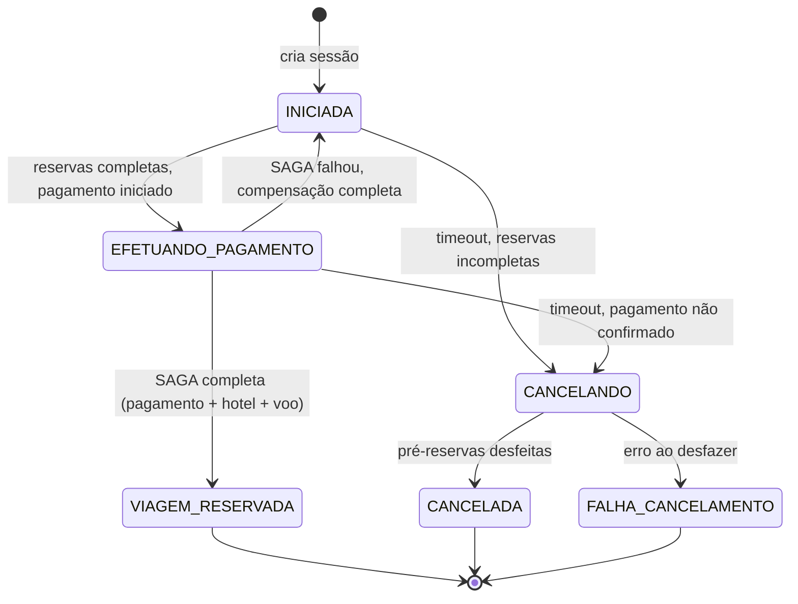
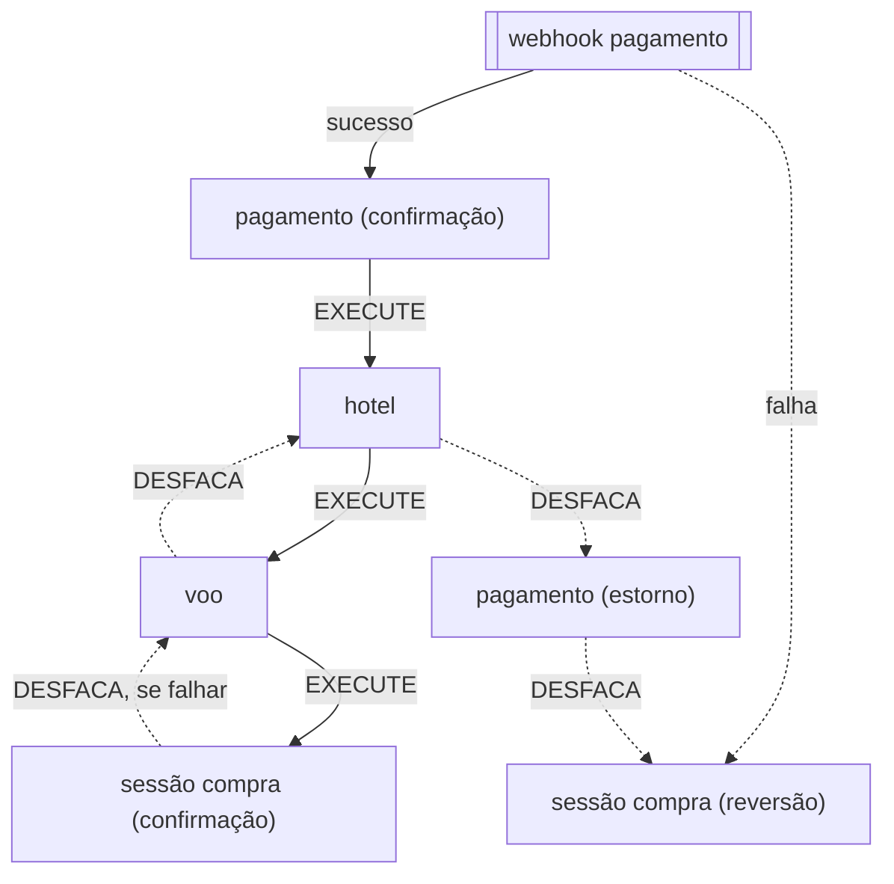

# Estudo Arquitetura (Monorepo)

Testando arquitetura para sistema (simplificado) de Agência de Viagens, simulando pagamento, reserva de hoteis e voos em serviços separados.

---

### 📌 **Análise de Arquitetura**
Confira o resumo das decisões arquiteturais em [CLAUDE.md](./CLAUDE.md) e o detalhamento por tópico em [docs/](./docs/README.md).

---

## Como funciona

### Estados de uma sessão de compra

### SAGA disparada a partir do webhook de pagamento

Desenho completo (inclui o que já está implementado vs. planejado) em [docs/purchase-flow-design.md](docs/purchase-flow-design.md); mecânica de fila já implementada (`pagamento → hotel → voo`) em [docs/saga-choreography.md](docs/saga-choreography.md).

---

## **TODO** 

* Encaixar e conectar todos os serviços (isso **demora**!)
  * Um pouquinho a cada final de semana e chegamos lá!
* Preencher as regras de negócio
  * _Vai ficar divertido fazendo isso com testes integrados_
* **(FEITO)** Contêineres Docker para os serviços
* **(FEITO)** Desenhar alguns diagramas para ilustrar como funcionam os serviços e a coreografia SAGAS
* Documentar inicialização e amostras de uso (quando estiver funcional)

## Módulos

* **clientes:** cadastra e autentica clientes
* **pagamento-externo**: simula serviço externo _instável_ de pagamento, com falhas, aceites e recusas; não precisa implementar lógica completa
* **pagamento-interno**: centraliza a lógica de negócio dos pagamentos; papel REST (webhook para o serviço externo comunicar confirmação/recusa) ou SAGAS (a confirmação de um pagamento envia mensagens para os sistemas de reservas realizarem a confirmação; a instância fica observando a fila pra estornar pagamentos em caso de erro nas reservas) escolhido por profile
* **reservas-externo:** simula serviços externos _instáveis_ para teste da arquitetura; não precisa implementar lógica completa
* **reservas-interno**: centraliza a lógica de negócio das reservas de voo e hotel; papel REST (interface web para reservas) ou SAGAS (responde a eventos de pagamento e erros para confirmação/cancelamento) escolhido por profile — deve haver ao menos uma instância de cada papel para voos e uma para hotel
* **sessaocompra:** centraliza a lógica de negócio das sessões de compra (bloqueios de consistência) e é o único ponto de contato do front ("porteiro") — orquestra as pré-reservas em `reservas-interno` por trás. Três papéis por profile: REST (interface web), TIMEOUT (dois jobs agendados: sessão sem reservas completas, e pagamento iniciado sem confirmação) e, no desenho planejado, fila (confirma/reverte a partir do resultado da SAGA — ver [docs/purchase-flow-design.md](docs/purchase-flow-design.md))
* **web-base:** módulos reusados nos serviços web: tratamento de erros, tokens JWT, client id/client secret

### A fazer

Como `sessaocompra` se conecta com os módulos abaixo (pré-reserva, pagamento, SAGA) está desenhado em [docs/purchase-flow-design.md](docs/purchase-flow-design.md) — os itens a seguir já refletem esse desenho, não o mecanismo antigo.

* [ ] **Timeout:** libera as pré-reservas diretamente via REST em `reservas-interno` — não é uma sequência SAGAS, a SAGA só começa depois que o pagamento já foi confirmado

* [ ] **Pagamentos**:
  * [ ] **web:** aciona o serviço externo, webhook de confirmação e erro
    * [ ] chama endpoints do serviço externo
    * [ ] webhook sucesso: publica `EXECUTE` na fila `pagamento` (dispara a SAGA de confirmação)
    * [ ] webhook falha: publica `DESFACA` direto na fila `sessaocompra` (nada a desfazer em hotel/voo/pagamento ainda)
  * [ ] **sagas:** eventos de confirmação e cancelamento
    * [ ] recebe do anterior e passa para o próximo (filas de "entrada" e saída)
    * [ ] início da cadeia (sem fila anterior própria) — só existe pra escutar compensação voltando de hotel/voo e repassar o estorno até `sessaocompra`
  * [X] **externo:** simula serviço externo, **introduz erros aleatórios**
    * [X] endpoints de pagamento e estorno, _devem falhar às vezes de propósito_
  * [ ] Testes integrados
    * [ ] Requisição > Externo > Webhook
    * [ ] Encaminha sucesso para outro serviço
    * [ ] Notificação de falha por outro serviço

* [ ] **Hotel:**
  * [X] **web:** interação com usuário (pré-reservas) — chamado por `sessaocompra`, não o inverso
    * [ ] chama endpoints do serviço externo
  * [ ] **sagas:** eventos de confirmação e cancelamento
    * [X] recebe do anterior e passa para o próximo (filas de "entrada" e saída)
    * [ ] chama endpoints do serviço externo
  * [X] **externo:** simula serviço externo, **introduz erros aleatórios**
    * [X] **pré-reserva:** cria reserva sem confirmação
    * [X] **confirmação:** confirma pré-reservas feitas _há menos de 15 minutos_
    * [X] **cancelamento:** cancela pré-reservas
    * [X] _deve falhar às vezes de propósito_
  * [ ] Testes integrados
    * [ ] Requisição > Externo
    * [ ] Encaminha sucesso para outro serviço
    * [ ] Notificação de falha por outro serviço

* [ ] **Voo:** para voos ida e volta, mesma estrutura de _Hotel_
  * [X] **web:** interação com usuário (pré-reservas) — chamado por `sessaocompra`, não o inverso
    * [ ] chama endpoints do serviço externo
  * [ ] **sagas:** eventos de confirmação e cancelamento por timeout
    * [X] recebe do anterior e passa para o próximo (filas de "entrada" e saída)
    * [ ] chama endpoints do serviço externo
    * [ ] fim da cadeia de sucesso: publica `EXECUTE` na fila `sessaocompra` (confirma a viagem); recebe `DESFACA` de volta se `sessaocompra` falhar ao confirmar
  * [X] **externo:** simula serviço externo, **introduz erros aleatórios**
    * [X] **pré-reserva:** cria reserva sem confirmação
    * [X] **confirmação:** confirma pré-reservas feitas _há menos de 15 minutos_
    * [X] **cancelamento:** cancela pré-reservas
    * [X] _deve falhar às vezes de propósito_
  * [ ] Testes integrados
    * [ ] Requisição > Externo
    * [ ] Encaminha sucesso para outro serviço
    * [ ] Notificação de falha por outro serviço

#### Tarefas repetidas

* [X] Serviços externos Voo/Hotel
  * [X] Pequeno banco de dados com id da reserva, id do cliente e status é suficiente
  * [X] **Simulação de falha dos endpoints externos:** um bom e velho `Math.random()` resolve
  * [X] 2 instâncias do mesmo projeto?
* [X] Serviços internos Voo/Hotel
  * [X] Chamadas aos serviços externos correspondentes
  * [X] **SAGAS:** conexão com uma fila de entrada e uma de saída (já tenho amostras com RabbitMQ em Python e Go)
  * [ ] Lógica de negócio (o "recheio")