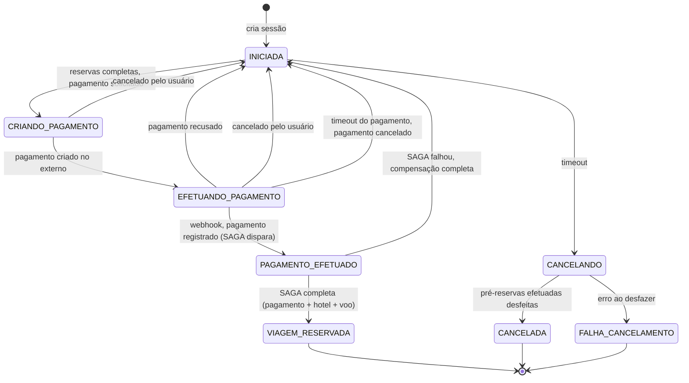
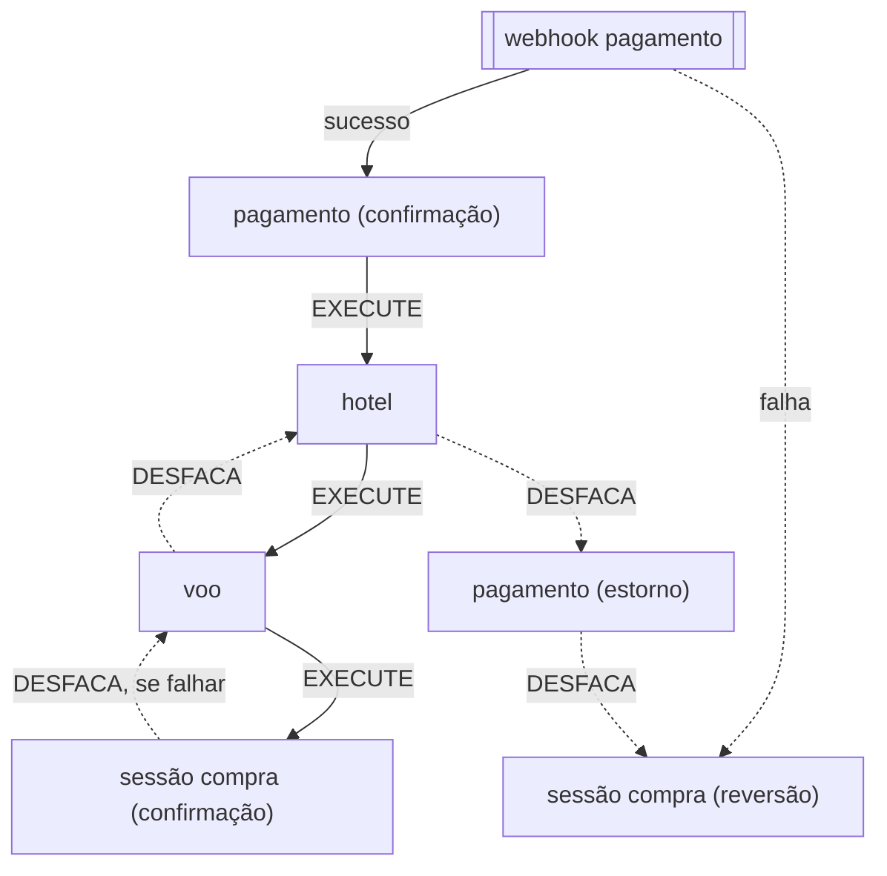

# Estudo Arquitetura (Monorepo)

Testando arquitetura para sistema (simplificado) de Agência de Viagens, simulando pagamento, reserva de hoteis e voos em serviços separados.

---

### 📌 **Análise de Arquitetura**
Confira o resumo das decisões arquiteturais em [CLAUDE.md](./CLAUDE.md) e o detalhamento por tópico em [docs/](./docs/README.md).

---

## Como funciona

### Estados de uma sessão de compra


```mermaid
stateDiagram-v2
    [*] --> INICIADA: cria sessão

    INICIADA --> CRIANDO_PAGAMENTO: reservas completas, pagamento solicitado
    CRIANDO_PAGAMENTO --> EFETUANDO_PAGAMENTO: pagamento criado no externo
    CRIANDO_PAGAMENTO --> INICIADA: cancelado pelo usuário
    INICIADA --> CANCELANDO: timeout

    EFETUANDO_PAGAMENTO --> PAGAMENTO_EFETUADO: webhook, pagamento registrado (SAGA dispara)
    EFETUANDO_PAGAMENTO --> INICIADA: pagamento recusado
    EFETUANDO_PAGAMENTO --> INICIADA: cancelado pelo usuário
    EFETUANDO_PAGAMENTO --> INICIADA: timeout do pagamento, pagamento cancelado

    PAGAMENTO_EFETUADO --> VIAGEM_RESERVADA: SAGA completa (pagamento + hotel + voo)
    PAGAMENTO_EFETUADO --> INICIADA: SAGA falhou, compensação completa

    CANCELANDO --> CANCELADA: pré-reservas efetuadas desfeitas
    CANCELANDO --> FALHA_CANCELAMENTO: erro ao desfazer

    VIAGEM_RESERVADA --> [*]
    CANCELADA --> [*]
    FALHA_CANCELAMENTO --> [*]
```

### SAGA disparada a partir do webhook de pagamento


```mermaid
flowchart TD
  WH[["webhook pagamento"]]
  WH -->|sucesso| PAGC["pagamento (confirmação)"]
  WH -.->|falha| SCR["sessão compra (reversão)"]

  PAGC -->|EXECUTE| HOT[hotel]
  HOT -->|EXECUTE| VOO[voo]
  VOO -->|EXECUTE| SCC["sessão compra (confirmação)"]

  SCC -.->|"DESFACA, se falhar"| VOO
  VOO -.->|DESFACA| HOT
  HOT -.->|DESFACA| PAGE["pagamento (estorno)"]
  PAGE -.->|DESFACA| SCR
```

Desenho completo (inclui o que já está implementado vs. planejado) em [docs/purchase-flow-design.md](docs/purchase-flow-design.md); mecânica de fila já implementada (`pagamento → hotel → voo`) em [docs/saga-choreography.md](docs/saga-choreography.md).

---

## Rodar localmente

* Copie `.env.example` → `.env` e `.env.clientes.example` → `.env.clientes`
* Gere seu próprio par de chaves JWT e preencha `JWT_PUBLIC_KEY`/`JWT_PRIVATE_KEY` — ver [docs/security-and-auth.md](docs/security-and-auth.md#gerar-o-par-de-chaves-local)
* `docker compose up`

---

## DIA HISTÓRICO: amarramos o SAGAS :)

Registro de quando a coreografia rodou ponta a ponta com handlers dummy (falha simulada no fim da cadeia). No código atual os handlers já começaram a ganhar regra de verdade e a saída abaixo não se reproduz — para rodar, faça antes `git checkout eb095f6` (num clone sem `.env` criado: esse commit ainda versionava os arquivos `.env`).

Para rodar:

```
docker compose up -d --build db broker pagamento-interno-web pagamento-interno-sagas reservas-interno-hotel-sagas reservas-interno-voo-sagas

curl -v -X POST http://localhost:8087/webhook -H "X-Client-Id: pagamentoExternoId" -H "X-Client-Secret: pagamentoExternoSecret" 2>&1 | tail -30

docker compose logs -f
```

Você deverá ver a saída:

```
pagamento-interno-web-1         | [webhook] disparando SAGA rastreio=5c144d50-a3c7-4290-8333-981f20f3e6d6
pagamento-interno-sagas-1       | [pagamento] confirmando cobrança — rastreio=5c144d50-a3c7-4290-8333-981f20f3e6d6
reservas-interno-hotel-sagas-1  | [hotel] confirmando reserva — rastreio=5c144d50-a3c7-4290-8333-981f20f3e6d6
reservas-interno-voo-sagas-1    | [voo] confirmando reserva — rastreio=5c144d50-a3c7-4290-8333-981f20f3e6d6
reservas-interno-hotel-sagas-1  | [hotel] cancelando reserva — rastreio=5c144d50-a3c7-4290-8333-981f20f3e6d6
pagamento-interno-sagas-1       | [pagamento] ESTORNANDO pagamento — rastreio=5c144d50-a3c7-4290-8333-981f20f3e6d6
```

---

## Testes

Só precisa do Docker no ar — Postgres e RabbitMQ sobem sozinhos via Testcontainers (nada do `docker compose`). Estratégia e regras em [docs/testing-strategy.md](docs/testing-strategy.md).

```bash
# testes de microsserviço (suíte padrão)
./mvnw test

# um módulo só (-am compila as libs de que ele depende)
./mvnw test -pl sessaocompra -am

# uma classe só
./mvnw test -pl sessaocompra -am -Dtest=SessaoCompraFluxoTest -Dsurefire.failIfNoSpecifiedTests=false

# testes integrados (serviços reais em container) — o package antes é obrigatório: o teste usa o jar compilado
./mvnw package -DskipTests && ./mvnw test -Pintegrado

# Postgres/RabbitMQ dos testes ficam de pé entre execuções (reuse) — pra liberar RAM:
docker rm -f $(docker ps -aq --filter label=org.testcontainers.hash)
```

---

## Módulos e em que pé estão

Pra quem está chegando: cada módulo com as etapas do fluxo em que ele aparece (as caixas dos diagramas acima, mais a pré-reserva e a criação do pagamento, que vêm antes). Papel entre parênteses. Detalhe do que falta: [docs/todo.md](docs/todo.md). Encaixar e conectar tudo **demora** — um pouquinho a cada final de semana e chegamos lá!

* **clientes**
  * [X] cadastro
  * [X] login, emite JWT
* **sessaocompra** — único ponto de contato do front com o backend ("porteiro")
  * [X] criar sessão (web)
  * [X] escolher/trocar hotel e voos (web)
  * [X] iniciar pagamento (web)
  * [ ] cancelar pagamento (web)
  * [ ] confirmar viagem, fim da SAGA (fila — só desenho)
  * [ ] reverter, falha na SAGA ou pagamento recusado (fila — só desenho)
  * [ ] expirar sessão (timeout)
  * [ ] expirar pagamento não confirmado (timeout)
* **reservas-interno** — hotel e voo
  * [X] pré-reserva / troca (web)
  * [ ] confirmar (sagas)
  * [ ] cancelar, compensação (sagas)
* **reservas-externo** — simula fornecedor _instável_ de hotel/voo
  * [X] criar pré-reserva
  * [X] confirmar
  * [X] cancelar pré-reserva
* **pagamento-interno**
  * [X] criar pagamento (web)
  * [ ] cancelar pagamento (web)
  * [ ] webhook (web — dispara a SAGA, mas sem dados de negócio)
  * [ ] confirmar pagamento (sagas — stub)
  * [ ] estornar (sagas — stub)
* **pagamento-externo** — simula gateway de pagamento _instável_
  * [ ] criar pagamento (sendo refeito)
  * [ ] pagar (simula o usuário na tela do gateway; chama o webhook)
  * [ ] expirar
  * [ ] estornar
* **web-base** (biblioteca: autenticação e tratamento de erro) — [X] pronto
* **sagas-common** (biblioteca: coreografia SAGA sobre RabbitMQ) — [ ] mecânica pronta; falta ordem ack/publish
