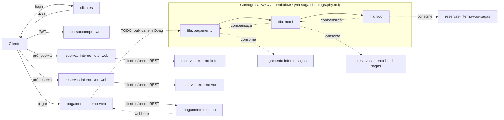

# Visão geral da arquitetura

## Stack

Java 25 (virtual threads habilitadas), Spring Boot 4.0.1, Maven multi-módulo (8 módulos + parent POM), Postgres 18.1 com Flyway, RabbitMQ 4.2.2 (cliente Java cru, não Spring AMQP), Docker Compose para orquestração local.

## Infra compartilhada

- **Postgres**: um único container, mas **um database por bounded context** (não é compartilhamento de schema): `clientes`, `sessaocompra`, `externo_hotel`, `externo_voo`, `interno_hotel`, `interno_voo`, `interno_pagamento` — ver [databases.sql](../databases.sql). Cada serviço `-web`/`-sagas` conecta só no seu database via `spring.datasource.url` no `application-<profile>.yaml`.
- **RabbitMQ**: broker único para a coreografia SAGA. Detalhe da mecânica em [saga-choreography.md](saga-choreography.md).

## Módulos e portas (via `.env` / `docker-compose.yml`)

| Módulo | Papel | Porta padrão | Depende de |
|---|---|---|---|
| `clientes` | cadastro/login, emite JWT | 8081 | db |
| `sessaocompra` (profile `web`) | árbitro de estado da compra | 8080 | db |
| `sessaocompra` (profile `timeout`) | job agendado, cancela sessões expiradas | — (sem porta web) | db |
| `reservas-externo` (profile `hotel`) | simulador instável do fornecedor de hotel | 8082 | db |
| `reservas-externo` (profile `voo`) | simulador instável do fornecedor de voo | 8083 | db |
| `reservas-interno` (profile `hotel,web`) | REST de pré-reserva de hotel | 8084 | db |
| `reservas-interno` (profile `voo,web`) | REST de pré-reserva de voo | 8085 | db |
| `reservas-interno` (profile `hotel,sagas`) | consumidor de fila `hotel` | — | db, broker |
| `reservas-interno` (profile `voo,sagas`) | consumidor de fila `voo` | — | db, broker |
| `pagamento-externo` | simulador instável de gateway de pagamento | 8086 | db |
| `pagamento-interno` (profile `web`) | REST de pagamento + webhook | 8087 | db |
| `pagamento-interno` (profile `sagas`) | consumidor de fila `pagamento` (início/fim da cadeia) | — | db, broker |

`reservas-externo` e `reservas-interno` são o **mesmo artefato** (cada um o seu) rodando várias vezes com `SPRING_PROFILES_ACTIVE` combinando domínio (`hotel`/`voo`) — e, no caso de `reservas-interno`, também papel (`web`/`sagas`) — cada instância com seu próprio database/fila. `pagamento-interno` não tem eixo de domínio (só existe um pagamento), então só varia por papel (`web`/`sagas`).

## Interno x externo

- **`-interno`**: controle de reservas no nível da **agência de viagens** — é quem participa da cadeia da SAGA e decide confirmar ou cancelar. Chama o `-externo` correspondente via REST (client-id/secret) pra efetivar a reserva do lado de fora.
- **`-externo`**: simula o **fornecedor real** (a companhia aérea, a rede de hotel) sendo chamado. Não participa da coreografia da SAGA — só responde a quem o chama, com falha e latência aleatórias propositais (chaos engineering — ver `ReservasService.seraQueVaiFalhar()` em `reservas-externo`).

## Padrão de módulos por domínio

Reservas, pagamento e sessão de compra já passaram pelo refactor descrito em [module-boundaries.md](module-boundaries.md#3-artefato-único-com-dois-entrypoints-escaláveis-por-configuração--concluído-para-reservas-pagamento-e-sessão-de-compra): os antigos módulos `-common`/`-web`/`-sagas` (ou `-timeout`) de cada domínio viraram um artefato único (`reservas-interno`, `pagamento-interno`, `sessaocompra`), com o papel escolhido por profile Spring em runtime — ver [deploy-roles-by-profile.md](deploy-roles-by-profile.md) pro mecanismo. Para pagamento, o papel `sagas` foi criado do zero (nunca tinha existido como módulo — ver [todo.md](todo.md)). `sessaocompra` é uma variação do mesmo mecanismo: não participa da coreografia SAGA, então o segundo papel não é `sagas`, é `timeout` (job `@Scheduled` que cancela sessões expiradas) — mesmo princípio (`@Profile`/`web-application-type: none`), sem depender de `sagas-common`.

Bibliotecas transversais, usadas por praticamente todo `-web`/`-externo`:

- **`web-base`**: autenticação (JWT para cliente final em `jwt/`, client-id/secret entre serviços em `internalclient/`) e tratamento de erro padronizado (`TrataErros`). Detalhe em [security-and-auth.md](security-and-auth.md).
- **`sagas-common`**: toda a comunicação com RabbitMQ e a mecânica de coreografia SAGA. Detalhe em [saga-choreography.md](saga-choreography.md).

## Fluxo de uma compra (como as peças se encaixam)

Pontos de ligação que ainda são TODO no código (não apenas na intenção) estão detalhados em [todo.md](todo.md) — em especial, `sessaocompra-web` está desenhada como "árbitro" (deveria ser chamada pelos outros serviços para mudar de estado, sem ela mesma orquestrar), mas as chamadas que fariam essa ligação ainda não existem.

## Convenção de configuração

Cada `-web`/`-sagas`/`-externo` tem `application.yaml` (comum) + `application-<profile>.yaml` (hotel/voo, quando aplicável) com porta, URL de datasource e credenciais client-id/secret específicas. Tudo parametrizado por variável de ambiente com default local (`${DB_HOST:localhost}`), o que permite rodar tanto via Docker Compose (`.env`) quanto localmente sem Docker.
