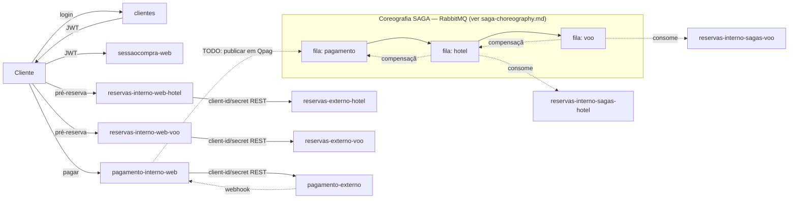

# Visão geral da arquitetura

## Stack

Java 25 (virtual threads habilitadas), Spring Boot 4.0.1, Maven multi-módulo (13 módulos + parent POM), Postgres 18.1 com Flyway, RabbitMQ 4.2.2 (cliente Java cru, não Spring AMQP), Docker Compose para orquestração local.

## Infra compartilhada

- **Postgres**: um único container, mas **um database por bounded context** (não é compartilhamento de schema): `clientes`, `sessaocompra`, `externo_hotel`, `externo_voo`, `interno_hotel`, `interno_voo`, `interno_pagamento` — ver [databases.sql](../databases.sql). Cada serviço `-web`/`-sagas` conecta só no seu database via `spring.datasource.url` no `application-<profile>.yaml`.
- **RabbitMQ**: broker único para a coreografia SAGA. Detalhe da mecânica em [saga-choreography.md](saga-choreography.md).

## Módulos e portas (via `.env` / `docker-compose.yml`)

| Módulo | Papel | Porta padrão | Depende de |
|---|---|---|---|
| `clientes` | cadastro/login, emite JWT | 8081 | db |
| `sessaocompra-web` | árbitro de estado da compra | 8080 | db |
| `sessaocompra-timeout` | job agendado, cancela sessões expiradas | — (sem porta web) | db |
| `reservas-externo` (profile `hotel`) | simulador instável do fornecedor de hotel | 8082 | db |
| `reservas-externo` (profile `voo`) | simulador instável do fornecedor de voo | 8083 | db |
| `reservas-interno-web` (profile `hotel`) | REST de pré-reserva de hotel | 8084 | db |
| `reservas-interno-web` (profile `voo`) | REST de pré-reserva de voo | 8085 | db |
| `reservas-interno-sagas` (profile `hotel`) | consumidor de fila `hotel` | — | db, broker |
| `reservas-interno-sagas` (profile `voo`) | consumidor de fila `voo` | — | db, broker |
| `pagamento-externo` | simulador instável de gateway de pagamento | 8086 | db |
| `pagamento-interno-web` | REST de pagamento + webhook | 8087 | db |
| `pagamento-interno-sagas` | **não existe ainda** — ver [todo.md](todo.md) | — | — |

`reservas-externo`, `reservas-interno-web` e `reservas-interno-sagas` são o **mesmo artefato** rodando duas vezes com `SPRING_PROFILES_ACTIVE=hotel` ou `voo`, cada instância com seu próprio database e fila.

## Padrão de módulos por domínio

Reservas e pagamento repetem a mesma receita (ver também [module-boundaries.md](module-boundaries.md)):

- **`-common`**: entidades JPA + regra de negócio + repositório. Biblioteca Maven, não é deployável sozinha.
- **`-web`**: expõe REST, depende do `-common` correspondente.
- **`-sagas`**: escuta fila de entrada e publica na próxima, depende do `-common`.
- **`-externo`**: simula o fornecedor real, com falha e latência aleatórias propositais (chaos engineering — ver `ReservasService.seraQueVaiFalhar()` em `reservas-externo`).

Bibliotecas transversais, usadas por praticamente todo `-web`/`-externo`:

- **`web-base`**: autenticação (JWT para cliente final em `jwt/`, client-id/secret entre serviços em `internalclient/`) e tratamento de erro padronizado (`TrataErros`). Detalhe em [security-and-auth.md](security-and-auth.md).
- **`sagas-common`**: toda a comunicação com RabbitMQ e a mecânica de coreografia SAGA. Detalhe em [saga-choreography.md](saga-choreography.md).

## Fluxo de uma compra (como as peças se encaixam)

Pontos de ligação que ainda são TODO no código (não apenas na intenção) estão detalhados em [todo.md](todo.md) — em especial, `sessaocompra-web` está desenhada como "árbitro" (deveria ser chamada pelos outros serviços para mudar de estado, sem ela mesma orquestrar), mas as chamadas que fariam essa ligação ainda não existem.

## Convenção de configuração

Cada `-web`/`-sagas`/`-externo` tem `application.yaml` (comum) + `application-<profile>.yaml` (hotel/voo, quando aplicável) com porta, URL de datasource e credenciais client-id/secret específicas. Tudo parametrizado por variável de ambiente com default local (`${DB_HOST:localhost}`), o que permite rodar tanto via Docker Compose (`.env`) quanto localmente sem Docker.
