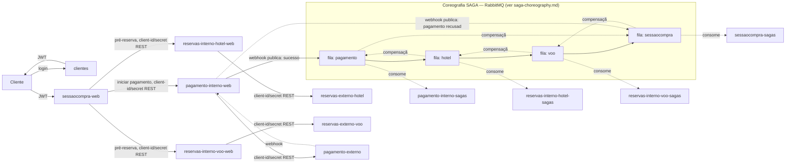

# Visão geral da arquitetura

## Stack

Java 25 (virtual threads habilitadas), Spring Boot 4.0.1, Maven multi-módulo (8 módulos + parent POM), Postgres 18.1 com Flyway, RabbitMQ 4.2.2 (cliente Java cru, não Spring AMQP), Docker Compose para orquestração local.

## Infra compartilhada

- **Postgres**: um único container, mas **um database por bounded context** (não é compartilhamento de schema): `clientes`, `sessaocompra`, `externo_hotel`, `externo_voo`, `interno_hotel`, `interno_voo`, `interno_pagamento` — ver [databases.sql](../databases.sql).
- **RabbitMQ**: broker único para a coreografia SAGA. Detalhe da mecânica em [saga-choreography.md](saga-choreography.md).

## Módulos e portas (via `.env` / `docker-compose.yml`)

| Módulo | Papel | Porta padrão | Depende de |
|---|---|---|---|
| `clientes` | cadastro/login, emite JWT | 8081 | db |
| `sessaocompra` (profile `web`) | árbitro de estado da compra | 8080 | db |
| `sessaocompra` (profile `timeout`) | job agendado, cancela sessões expiradas | — (sem porta web) | db |
| `sessaocompra` (profile `sagas`) | pontas da SAGA: confirma a viagem / reverte a sessão | — | db, broker |
| `reservas-externo` (profile `hotel`) | simulador instável do fornecedor de hotel | 8082 | db |
| `reservas-externo` (profile `voo`) | simulador instável do fornecedor de voo | 8083 | db |
| `reservas-interno` (profile `hotel,web`) | REST de pré-reserva de hotel | 8084 | db |
| `reservas-interno` (profile `voo,web`) | REST de pré-reserva de voo | 8085 | db |
| `reservas-interno` (profile `hotel,sagas`) | consumidor de fila `hotel` | — | db, broker |
| `reservas-interno` (profile `voo,sagas`) | consumidor de fila `voo` | — | db, broker |
| `pagamento-externo` | simulador instável de gateway de pagamento (sem banco) | 8086 | — |
| `pagamento-interno` (profile `web`) | REST de pagamento + webhook (publica o início da SAGA) | 8087 | db, broker |
| `pagamento-interno` (profile `sagas`) | consumidor de fila `pagamento` (início/fim da cadeia) | — | db, broker |

`reservas-externo` e `reservas-interno` são o **mesmo artefato** (cada um o seu) rodando várias vezes com `SPRING_PROFILES_ACTIVE` combinando domínio (`hotel`/`voo`) — e, no caso de `reservas-interno`, também papel (`web`/`sagas`) — cada instância com seu próprio database/fila. `pagamento-interno` não tem eixo de domínio (só existe um pagamento), então só varia por papel (`web`/`sagas`).

## Interno x externo

- **`-interno`**: controle de reservas no nível da **agência de viagens** — é quem participa da cadeia da SAGA e decide confirmar ou cancelar. Chama o `-externo` correspondente via REST (client-id/secret) pra efetivar a reserva do lado de fora.
- **`-externo`**: simula o **fornecedor real** (a companhia aérea, a rede de hotel) sendo chamado. Não participa da coreografia da SAGA — só responde a quem o chama, com falha e latência aleatórias propositais (chaos engineering — ver `ReservasService.seraQueVaiFalhar()` em `reservas-externo`).

## Padrão de módulos por domínio

Reservas, pagamento e sessão de compra são cada um um artefato único por domínio (`reservas-interno`, `pagamento-interno`, `sessaocompra`), com controller REST e listener de fila no mesmo processo — o papel ativo em cada instância é escolhido por profile Spring em runtime, ver [deploy-roles-by-profile.md](deploy-roles-by-profile.md) pro mecanismo. `sessaocompra` tem um papel a mais: `timeout` (job `@Scheduled` que cancela sessões expiradas) — mesmo princípio (`@Profile`/`web-application-type: none`).

Bibliotecas transversais, usadas por praticamente todo `-web`/`-externo`:

- **`web-base`**: autenticação (JWT para cliente final em `jwt/`, client-id/secret entre serviços em `internalclient/`) e tratamento de erro padronizado (`TrataErros`). Detalhe em [security-and-auth.md](security-and-auth.md).
- **`sagas-common`**: toda a comunicação com RabbitMQ e a mecânica de coreografia SAGA. Detalhe em [saga-choreography.md](saga-choreography.md).

## Fluxo de uma compra (como as peças se encaixam)

```mermaid
flowchart LR
  C[Cliente] -->|login| clientes
  clientes -->|JWT| C
  C -->|JWT| sessaocompra-web
  sessaocompra-web -->|pré-reserva, client-id/secret REST| reservas-interno-hotel-web
  sessaocompra-web -->|pré-reserva, client-id/secret REST| reservas-interno-voo-web
  reservas-interno-hotel-web -->|client-id/secret REST| reservas-externo-hotel
  reservas-interno-voo-web -->|client-id/secret REST| reservas-externo-voo
  sessaocompra-web -->|iniciar pagamento, client-id/secret REST| pagamento-interno-web
  pagamento-interno-web -->|client-id/secret REST| pagamento-externo
  pagamento-externo -.webhook.-> pagamento-interno-web

  subgraph SAGA["Coreografia SAGA — RabbitMQ (ver saga-choreography.md)"]
    Qpag[fila: pagamento] --> Qhotel[fila: hotel]
    Qhotel --> Qvoo[fila: voo]
    Qvoo --> Qsc[fila: sessaocompra]
    Qsc -.compensação.-> Qvoo
    Qvoo -.compensação.-> Qhotel
    Qhotel -.compensação.-> Qpag
    Qpag -.compensação.-> Qsc
  end

  pagamento-interno-web -->|webhook publica: sucesso| Qpag
  pagamento-interno-web -.webhook publica: pagamento recusado.-> Qsc
  Qsc -.consome.-> sessaocompra-sagas
  Qpag -.consome.-> pagamento-interno-sagas
  Qhotel -.consome.-> reservas-interno-hotel-sagas
  Qvoo -.consome.-> reservas-interno-voo-sagas
```

`sessaocompra-web` é o único ponto de contato do front ("porteiro"): chama `reservas-interno` e `pagamento-interno` por trás. A volta do resultado da SAGA até `sessaocompra` está em [purchase-flow-design.md](purchase-flow-design.md).

## Convenção de configuração

Cada `-web`/`-sagas`/`-externo` tem `application.yaml` (comum) + `application-<profile>.yaml` (hotel/voo, quando aplicável) com porta, URL de datasource e credenciais client-id/secret específicas. Tudo parametrizado por variável de ambiente com default local (`${DB_HOST:localhost}`), o que permite rodar tanto via Docker Compose (`.env`) quanto localmente sem Docker.
