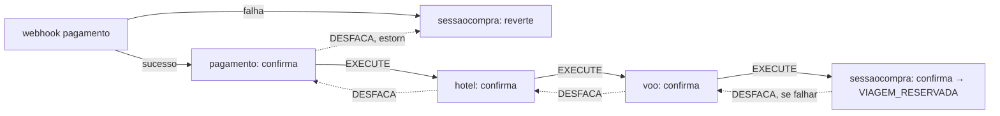

# Fluxo de compra — desenho (não implementado)

Resultado de uma sessão de arquitetura (2026-08-02) sobre como `sessaocompra` amarra pré-reservas, pagamento e a SAGA. **A seção "Interação do usuário" abaixo (até o disparo do pagamento) está implementada** (sessão de 2026-08-09) — falta só a "SAGA estendida" mais abaixo, que continua desenho. Complementa [saga-choreography.md](saga-choreography.md) (mecânica já implementada) e [todo.md](todo.md) (lacunas atuais).

## Interação do usuário

Implementado em `SessaoCompraController`/`SessaoCompraService`/`SessaoCompraRepository` (código é a fonte de verdade pro mecanismo). Decisões de negócio por trás:

1. `idCliente` vem do JWT só na criação da sessão, nunca de update posterior. Cliente pode ter **múltiplas sessões simultâneas** (decisão deliberada, não uma-por-cliente); ownership por sessão via `@PreAuthorize` (ver [security-and-auth.md](security-and-auth.md)).
2. Re-seleção de item já escolhido faz troca de verdade (não cria e ignora a antiga): adquire a nova antes de liberar a antiga, nunca ao contrário — evita deixar o cliente sem nada se a nova falhar. Liberação da antiga é melhor esforço; o timeout do próprio `reservas-externo` é a rede de segurança.
3. `sessaocompra` é o único ponto de contato do front ("porteiro") — front nunca fala direto com `reservas-interno`/`pagamento-interno`, nem sabe os ids de reserva.

## Dois timeouts

- **`TimeoutTask` (existente)**: sessões em `INICIADA` que passam de `TEMPO_MAXIMO` sem completar as reservas e iniciar pagamento → cancela.
- **novo, planejado (`TimeoutPagamentoTask`)**: sessões em `EFETUANDO_PAGAMENTO` que passam de uma janela própria (mais longa, alinhada à validade do meio de pagamento — PIX/redirect de gateway) sem confirmação → expira. Precisa de uma coluna de timestamp própria pro início do pagamento (`start_time` hoje só marca o início da sessão inteira).

Os dois competem com a mudança de estado feita pelo mesmo tipo de update condicional guardado por `status` (`WHERE status = '...'`) já usado em `iniciarPagamento`/`marcarLoteComoCancelando` — quem mudar o status primeiro no banco "vence"; o outro não encontra mais linha pra afetar.

## SAGA estendida — sessaocompra como bookend do anel

Cadeia de negócio hoje é `pagamento → hotel → voo` (mecânica em [saga-choreography.md](saga-choreography.md)). O desenho estende o anel com dois nós novos que fazem update local em `SessaoCompra`, reaproveitando o mesmo mecanismo de "handler lança exceção → compensação automática pra trás" do `sagas-common` — sem framework novo.

- **Sucesso**: webhook de pagamento → confirma em `pagamento` → `hotel` → `voo` → `sessaocompra` marca `VIAGEM_RESERVADA`. Fim de cadeia.
- **Falha em qualquer etapa (inclusive em `sessaocompra: confirma`)**: propaga DESFACA pra trás até `sessaocompra: reverte`, que volta a sessão pro estado anterior e reseta o timer de expiração (dá mais tempo pro usuário escolher outra opção de voo/hotel/pagamento).
- **Falha direto no webhook** (pagamento recusado, nada chegou a ser confirmado): pula o anel inteiro, vai direto pra `sessaocompra: reverte` — não há nada em `pagamento`/`hotel`/`voo` pra desfazer.
- **Discard vs. reverter**: quem detecta a falha de confirmação (ex. `voo`, item não disponível mais no fornecedor) trata isso como erro local *antes* de publicar DESFACA — zera a própria pré-reserva. Quem só recebe DESFACA nunca é quem falhou (por construção da coreografia), então sempre faz a mesma ação: reverter pra pré-. Não precisa de flag na mensagem pra essa distinção — mas precisa saber qual linha local afetar (ver "Payload da mensagem da SAGA" abaixo).
- Consequência: `sessaocompra` passa a ter um consumidor de fila mínimo pros dois nós novos. Hoje ela não depende de `sagas-common` nem participa da coreografia — isso muda com esse desenho (ver nota em [CLAUDE.md](../CLAUDE.md) e [deploy-roles-by-profile.md](deploy-roles-by-profile.md), que hoje afirmam o contrário como decisão tomada).
- **Mecanismo de fiação — reaproveita `proximafila`/`filaanterior`, não precisa de "dois nós" de verdade.** Os dois pontos de contato do diagrama colapsam numa única fila nova (`sessaocompra`), porque o protocolo já resolve isso: configurar `proximafila: sessaocompra` em `voo` (hoje sem `proximafila`, fim da cadeia) e `filaanterior: sessaocompra` em `pagamento` (hoje sem `filaanterior`, início da cadeia) é suficiente — `Messaging.iniciarConsumo` já publica em `filaProximoServico` no caminho `EXECUTE` e em `filaServicoAnterior` no caminho `DESFACA` (ver [saga-choreography.md](saga-choreography.md)). Um único handler em `sessaocompra`, igual aos outros, recebe as duas direções na mesma fila e decide o que fazer olhando o campo `tipo` da mensagem (`EXECUTE` → confirma; `DESFACA` → reverte) — mesmo padrão que `ReservasSagas`/`PagamentoSagas` já vão seguir.
- **Caso "falha direto no webhook" precisa de publish fora do fluxo normal.** Publicar `DESFACA` direto em `sessaocompra` sem passar pelo anel exige que o profile `web` de `pagamento-interno` também consiga publicar mensagem (hoje só o profile `sagas`, via `SagasWiring`, tem essa capacidade) — é a mesma lacuna já registrada em [todo.md](todo.md) pro caso de sucesso (webhook precisa publicar `EXECUTE` em `pagamento`); os dois casos (sucesso e falha do webhook) resolvem juntos quando essa capacidade de publish existir no profile `web`.

## Payload da mensagem da SAGA

Hoje a mensagem só carrega `tipo` + `rastreio` (opaco, sem ligação com sessão/reserva alguma — ver [saga-choreography.md](saga-choreography.md)). Cada handler que precisa agir num recurso específico teria que descobrir sozinho qual — hoje isso nem dá pra fazer (não tem por onde). Decisão: em vez de um id de correlação genérico + busca em cada elo, a mensagem passa a carregar os ids internos que cada handler precisa, desde a primeira publicação no webhook.

**Só ids internos viajam na mensagem — nunca `idExterno`** (todos populados uma vez, na origem):

- `idSessaoCompra` — nós bookend de `sessaocompra` (`confirma`/`reverte`, ver "SAGA estendida" acima).
- `idPagamento` — id interno (PK) da linha em `pagamentos` (`pagamento-interno`), usado por `PagamentoSagas`.
- `idReservaHotel` — id interno (PK) da linha em `reservas`, usado por `ReservasSagas` (profile `hotel`).
- `idReservaVooIda` / `idReservaVooVolta` — mesmo papel, pro profile `voo`. **Nota:** a cadeia tem um único nó `voo`, mas a sessão de compra tem duas reservas de voo — o handler de `voo` vai precisar agir nas duas a partir da mesma mensagem; forma exata (chamadas sequenciais? o que acontece se uma falhar e a outra não?) ainda não desenhada.

**Por que não `idExterno` também:** cada instância `sagas` (`ReservasSagas`/`PagamentoSagas`) roda no mesmo processo/banco que o papel `web` do mesmo domínio — não é um serviço separado, é só outro profile do mesmo artefato (ver [deploy-roles-by-profile.md](deploy-roles-by-profile.md)). Achar `idExterno` a partir do `idReserva`/`idPagamento` é um `findById` pela PK, local, indexado — não é o tipo de busca que a mensagem "rica" tenta evitar. O que se evita são duas coisas bem diferentes:
- `idExterno` cruzar a fronteira de `reservas-interno`/`pagamento-interno` sem necessidade — não é assunto de `sessaocompra`, do webhook, nem da mensagem da SAGA; é detalhe interno de como cada domínio fala com seu provedor externo. `sessaocompra` continua recebendo só `id` de `reservas-interno` (`ReservaDTO` continua devolvendo `idExterno` também, mas isso já é hoje — não muda, `sessaocompra` só nunca captura esse campo).
- O webhook sair chamando os outros serviços via HTTP só pra montar a mensagem — isso sim seria excesso de chamada de rede pra buscar algo que cada serviço já tem local, no próprio banco.

**Cadeia de propagação — uma única chamada nova resolve tudo, o resto já existe pela metade:**

1. `sessaocompra` já tem `idReservaHotel`/`idReservaVooIda`/`idReservaVooVolta` — nenhuma mudança necessária aqui.
2. ~~**Única chamada nova: `sessaocompra` → `pagamento-interno`**~~ — implementado: `PagamentoInternoClient`/`POST /pagamentos`, disparada de `iniciarPagamento` depois da transição de status (fora de transação, mesma convenção de `reservas-interno`) — passa `idSessaoCompra` + os 3 `idReserva*` numa tacada só.
3. ~~`pagamento-interno` aciona `pagamento-externo` de verdade~~ — implementado: `PagamentoExternoService.efetuar` chama `POST /efetuar` (`PagamentoResponseDTO`/`idTransacao`). `pagamento-interno` salva **uma linha só** em `pagamentos` com tudo que tem nesse instante: `id` (própria PK), `id_externo = idTransacao`, `idSessaoCompra`, os 3 `idReserva*` (migration `V2`). **Achado:** `application.yaml` de `pagamento-interno` tinha os pares client-id/secret de `external-backend`/`internal-backend` trocados entre si (dois pares existiam, mas cada lado apontava pro par errado) — só ficou visível agora que a chamada real existe; corrigido.
4. Mais tarde, `pagamento-externo.WebhookService.enviarResposta` dispara o callback — mas `WebhookRequestDTO` hoje só carrega `status`, **sem `idTransacao`**. Sem isso não dá pra correlacionar a resposta com a linha certa. Precisa carregar `idTransacao` também.
5. `PagamentoInternoController.webhookServicoExterno()` recebe o corpo (hoje não tem nenhum) com `idTransacao` + `status`, busca `pagamentos WHERE id_externo = idTransacao` (coluna já existe, já é o id de correlação natural desse par requisição/resposta) e monta a mensagem da SAGA com `idPagamento` — **a PK da linha (`pagamentos.id`), não `idTransacao`** — mesma distinção de `idReserva`/`idExterno` em reservas: `idTransacao` só serve pra achar a linha aqui, nunca viaja na mensagem. Publica.
6. `ReservasSagas`/`PagamentoSagas`: cada um lê da mensagem só o id que lhe interessa e faz `findById` local pra pegar `idExterno` (e o resto que precisar) do próprio banco — já implementado em `ReservasSagas` (`repositorio.findById(idReserva)`), esperando só o campo chegar na mensagem.

Ou seja: nenhum serviço recebe uma "mensagem web" só pra ir buscar algo no banco e devolver — cada chamada de rede nessa cadeia já carrega dado de negócio que precisava viajar de qualquer forma (pedir/confirmar pagamento). O único ponto novo de verdade é o passo 2.

Isso destrava o TODO de `ReservasSagas.idExternoDaMensagem` (hoje lança `UnsupportedOperationException` de propósito) na seção seguinte.

## Status de `Reserva` e não-idempotência de `reservas-externo`

Dois axiomas assumidos pra esse simulador (decisão de design deliberada — não é ponto a reavaliar):

1. **Cancelamento/expiração automática do lado externo é confiável.** TTL de 15min em `criar`/`confirmar` (`ReservasService`/`ReservasRepository`, `reservas-externo`); os dois são `@Transactional`, então falha explícita = zero efeito colateral. Consequência: o caminho de compensação (cancelar/liberar) não precisa de entrega garantida — melhor esforço basta, mesmo padrão que `ReservasService.liberarMelhorEsforco` (`reservas-interno`) já usa.
2. **`confirmar`/`remover` são e continuam não-idempotentes.** Guarda estrita `WHERE confirmado = false` em `ReservasRepository` (`reservas-externo`) — uma segunda chamada depois de sucesso real dá o mesmo erro (`EntityNotFoundException`) de uma falha real, sem key nem endpoint de consulta pra desambiguar. Toda a responsabilidade de nunca chamar `confirmar` duas vezes cai em `reservas-interno` — sem ajuda do lado de lá.
3. **`reservas-externo` precisa de um endpoint de consulta (`consultar`).** Sem ele, um timeout em `confirmar` é ambiguidade irredutível — dado o axioma 2, sucesso e falha real são indistinguíveis sem perguntar de volta à fonte de verdade. É o que torna o resto deste desenho possível; ainda não implementado (ver [todo.md](todo.md)).

### Arquitetura: caminho feliz síncrono, caminho lento em background

- **caminho feliz** (chamada externa dá resposta definitiva — sucesso ou falha de negócio): continua síncrono, `sagas-common` como está hoje ou com extensão leve — sem delay, sem task.
- melhora no framework SAGAS (`Messaging`) — estende, não troca:
  - suportar erros "tratados" (de negócio) com ack + publica para trás — pula a DLQ, que fica só pra falha sistêmica/inesperada
  - suportar "ack" puro para retentativa em caso de falha em *obter resposta* do serviço externo — obrigatório: `basicQos(1)` faz segurar sem ack travar a instância consumidora inteira
- status de intenção + task de retentativa (não redelivery do RabbitMQ)
  - novo status de intenção + contador de tentativas em `Reserva` (nomes ainda em aberto; hoje só `id`+`idExterno`, migration já tem `-- TODO falta status`), transição idempotente (`WHERE` aceita estado anterior ou já-no-alvo)
  - idempotente
  - limite de vezes por reserva — sobre tentativas de *obter resposta* do `consultar` (axioma 3 acima), não de `confirmar`
  - também realiza tarefas de fila
    - chama `consultar` pra saber o estado real (seguro de repetir — leitura pura)
    - sequência SAGAS para frente (sucesso) ou para trás (falha de negócio), via `Messaging.publicar()` — só o primitivo de publish, o loop de ack/nack de `iniciarConsumo` não serve aqui
    - publica *antes* de marcar status terminal — se a escrita cair no meio, o próximo tick refaz com segurança; pior caso é mensagem duplicada, downstream já tolera at-least-once (ordem inversa exigiria um segundo scan estilo outbox)
    - quando estoura o limite de tentativas de *obter resposta*: publica mensagem corrente na DLQ manualmente (`basicPublish` direto, sem delivery tag pra `nack`) + publica para trás
      - *esse* é o único momento em que faz sentido para a gente jogar o cara para a DLQ

**Gap concreto, independente dos axiomas acima:** `remover` também exige `WHERE confirmado = false` — hoje não existe operação em `reservas-externo` pra desfazer uma reserva já confirmada. Isso bloqueia de verdade o caso "DESFACA chega numa `Reserva` já `RESERVADA`, reverte pra pré-" descrito em "Discard vs. reverter" acima. Precisa de um endpoint tipo `desconfirmar`/estorno em `reservas-externo` antes desse caminho de compensação funcionar ponta a ponta.

**Nota relacionada (achado separado, mesmo handler):** `Messaging.iniciarConsumo` hoje dá `basicAck` da mensagem recebida **antes** de publicar a próxima na cadeia (`Messaging.java`) — uma queda nesse intervalo perde a publicação sem redelivery (mensagem já foi consumida). Não afeta o status de intenção acima (esse depende do ack da mensagem *de entrada*, que só acontece depois do handler terminar), mas é outro furo de mesma natureza a corrigir na mesma área.

## O que isso desbloqueia / próximos passos

- ~~Endpoints incrementais por tipo de reserva~~ — feito.
- ~~Gate de completude em `iniciarPagamento`~~ — feito.
- ~~Client-id/secret `sessaocompra` → `reservas-interno`~~ — feito, reaproveitando credenciais existentes (ver [security-and-auth.md](security-and-auth.md)).
- ~~`SecurityConfiguration`/`@PreAuthorize` em `sessaocompra`~~ — feito.
- ~~Endpoint de troca em `reservas-interno`~~ — feito, ver item 2 acima.
- `TimeoutPagamentoTask` + coluna de timestamp do início do pagamento.
- Payload da mensagem SAGA com id de correlação.
- Fila nova `sessaocompra` + handler único (branch por `tipo`), `voo.proximafila`/`pagamento.filaanterior` apontando pra ela.
- Capacidade de publish no profile `web` de `pagamento-interno` (hoje só `sagas` publica) — necessária pro webhook de sucesso e de falha.
- Implementação real dos handlers de negócio em `ReservasSagas`/`PagamentoSagas` (ver [todo.md](todo.md)).
- Ordem de start-up `sessaocompra-web` × `reservas-interno-*-web` no `docker-compose.yml` (checar ciclo em `depends_on`).
- Robustez do fluxo confirmar/reverter `Reserva` (endpoint `consultar`, endpoint `desconfirmar`/estorno, dois desfechos novos em `Messaging`, status de intenção + task de retentativa, handler de `ReservasSagas`) — quebra em tarefas em [todo.md](todo.md), seção "Dual-write pagamento/reservas".
- Reordenar `ack`/publish em `Messaging` (ver nota acima).
