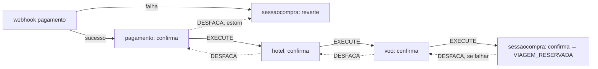

# Fluxo de compra — desenho (não implementado)

Resultado de uma sessão de arquitetura (2026-08-02) sobre como `sessaocompra` amarra pré-reservas, pagamento e a SAGA. **Nada abaixo está implementado** — é o desenho para a próxima sessão de implementação. Complementa [saga-choreography.md](saga-choreography.md) (mecânica já implementada) e [todo.md](todo.md) (lacunas atuais).

## Interação do usuário

1. Informa/atualiza `idCliente` na sessão (login em `clientes`, depois grava na sessão).
2. Reserva hotel e voo(s), em qualquer ordem — cada reserva passa por um endpoint dedicado em `sessaocompra` (um por tipo, não um update genérico com os campos juntos), que internamente chama `reservas-interno` e grava só aquele ID.
3. Dispara pagamento — só deve ser permitido quando todas as reservas exigidas estiverem preenchidas (gate de completude ainda não existe em `iniciarPagamento`).

`sessaocompra` é o único ponto de contato do front — front nunca fala direto com `reservas-interno`/`pagamento-interno` ("porteiro do front-end"), evitando que o front precise carregar estado entre chamadas.

## Dois timeouts

- **`TimeoutTask` (existente)**: sessões em `INICIADA` que passam de `TEMPO_MAXIMO` sem completar as reservas e iniciar pagamento → cancela.
- **novo, planejado (`TimeoutPagamentoTask`)**: sessões em `EFETUANDO_PAGAMENTO` que passam de uma janela própria (mais longa, alinhada à validade do meio de pagamento — PIX/redirect de gateway) sem confirmação → expira. Precisa de uma coluna de timestamp própria pro início do pagamento (`start_time` hoje só marca o início da sessão inteira).

Os dois competem com a mudança de estado feita pelo mesmo tipo de update condicional guardado por `status` (`WHERE status = '...'`) já usado em `iniciarPagamento`/`marcarLoteComoCancelando` — quem mudar o status primeiro no banco "vence"; o outro não encontra mais linha pra afetar.

## SAGA estendida — sessaocompra como bookend do anel

Cadeia de negócio hoje é `pagamento → hotel → voo` (mecânica em [saga-choreography.md](saga-choreography.md)). O desenho estende o anel com dois nós novos que fazem update local em `SessaoCompra`, reaproveitando o mesmo mecanismo de "handler lança exceção → compensação automática pra trás" do `sagas-common` — sem framework novo.

- **Sucesso**: webhook de pagamento → confirma em `pagamento` → `hotel` → `voo` → `sessaocompra` marca `VIAGEM_RESERVADA`. Fim de cadeia.
- **Falha em qualquer etapa (inclusive em `sessaocompra: confirma`)**: propaga DESFACA pra trás até `sessaocompra: reverte`, que volta a sessão pro estado anterior e reseta o timer de expiração (dá mais tempo pro usuário escolher outra opção de voo/hotel/pagamento).
- **Falha direto no webhook** (pagamento recusado, nada chegou a ser confirmado): pula o anel inteiro, vai direto pra `sessaocompra: reverte` — não há nada em `pagamento`/`hotel`/`voo` pra desfazer.
- **Discard vs. reverter**: quem detecta a falha de confirmação (ex. `voo`, item não disponível mais no fornecedor) trata isso como erro local *antes* de publicar DESFACA — zera a própria pré-reserva. Quem só recebe DESFACA nunca é quem falhou (por construção da coreografia), então sempre faz a mesma ação: reverter pra pré-. Não precisa de flag na mensagem pra essa distinção — mas a mensagem ainda precisa de um id de correlação (sessão de compra) pra cada handler saber qual linha local afetar (item já pendente, ver [todo.md](todo.md)).
- Consequência: `sessaocompra` passa a ter um consumidor de fila mínimo pros dois nós novos. Hoje ela não depende de `sagas-common` nem participa da coreografia — isso muda com esse desenho (ver nota em [CLAUDE.md](../CLAUDE.md), [module-boundaries.md](module-boundaries.md) e [deploy-roles-by-profile.md](deploy-roles-by-profile.md), que hoje afirmam o contrário como decisão tomada).
- **Mecanismo de fiação — reaproveita `proximafila`/`filaanterior`, não precisa de "dois nós" de verdade.** Os dois pontos de contato do diagrama colapsam numa única fila nova (`sessaocompra`), porque o protocolo já resolve isso: configurar `proximafila: sessaocompra` em `voo` (hoje sem `proximafila`, fim da cadeia) e `filaanterior: sessaocompra` em `pagamento` (hoje sem `filaanterior`, início da cadeia) é suficiente — `SagasMessaging.iniciarConsumo` já publica em `filaProximoServico` no caminho `EXECUTE` e em `filaServicoAnterior` no caminho `DESFACA` (ver [saga-choreography.md](saga-choreography.md)). Um único handler em `sessaocompra`, igual aos outros, recebe as duas direções na mesma fila e decide o que fazer olhando o campo `tipo` da mensagem (`EXECUTE` → confirma; `DESFACA` → reverte) — mesmo padrão que `ReservasSagas`/`PagamentoSagas` já vão seguir.
- **Caso "falha direto no webhook" precisa de publish fora do fluxo normal.** Publicar `DESFACA` direto em `sessaocompra` sem passar pelo anel exige que o profile `web` de `pagamento-interno` também consiga publicar mensagem (hoje só o profile `sagas`, via `SagasWiring`, tem essa capacidade) — é a mesma lacuna já registrada em [todo.md](todo.md) pro caso de sucesso (webhook precisa publicar `EXECUTE` em `pagamento`); os dois casos (sucesso e falha do webhook) resolvem juntos quando essa capacidade de publish existir no profile `web`.

## O que isso desbloqueia / próximos passos

- Endpoints incrementais em `SessaoCompraController` por tipo de reserva (substituindo `updateSessaoInteracaoCompra`, que hoje faz `SET` dos 4 campos de uma vez só).
- Gate de completude em `iniciarPagamento` (checar as 3 colunas de reserva preenchidas antes de mudar pra `EFETUANDO_PAGAMENTO`).
- `TimeoutPagamentoTask` + coluna de timestamp do início do pagamento.
- Payload da mensagem SAGA com id de correlação.
- Fila nova `sessaocompra` + handler único (branch por `tipo`), com `voo.proximafila` e `pagamento.filaanterior` apontando pra ela — sem plumbing nova, só configuração + handler.
- Capacidade de publish no profile `web` de `pagamento-interno` (hoje só `sagas` publica) — necessária tanto pro webhook de sucesso (publicar `EXECUTE` em `pagamento`, já pendente em [todo.md](todo.md)) quanto pro de falha (publicar `DESFACA` direto em `sessaocompra`).
- Client-id/secret novo para a chamada HTTP `sessaocompra` → `reservas-interno` (relação que não existe hoje — ver [security-and-auth.md](security-and-auth.md)).
- Revisitar a ausência de `SecurityConfiguration`/JWT em `sessaocompra` agora que ela vira o único ponto de contato do front, não só mais um serviço interno.
- Implementação real dos handlers de negócio em `ReservasSagas`/`PagamentoSagas` — pré-requisito, já listado em [todo.md](todo.md).
