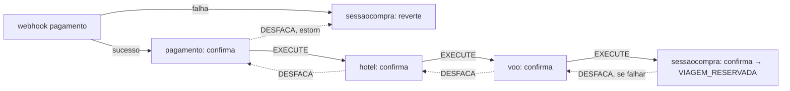

# Fluxo de compra — desenho

Resultado de uma sessão de arquitetura (2026-08-02) sobre como `sessaocompra` amarra pré-reservas, pagamento e a SAGA. Complementa [saga-choreography.md](saga-choreography.md) (mecânica de fila). O que falta implementar: [todo.md](todo.md).

## Interação do usuário

Mecanismo em [SessaoCompraController](../sessaocompra/src/main/java/com/derso/arquitetura/sessaocompra/app/SessaoCompraController.java)/[SessaoCompraService](../sessaocompra/src/main/java/com/derso/arquitetura/sessaocompra/SessaoCompraService.java). Decisões de negócio por trás:

1. `idCliente` vem do JWT só na criação da sessão, nunca de update posterior. Cliente pode ter **múltiplas sessões simultâneas** (decisão deliberada, não uma-por-cliente); ownership por sessão via `@PreAuthorize` (ver [security-and-auth.md](security-and-auth.md)).
2. Re-seleção de item já escolhido faz troca de verdade (não cria e ignora a antiga): adquire a nova antes de liberar a antiga, nunca ao contrário — evita deixar o cliente sem nada se a nova falhar. Liberação da antiga é melhor esforço; o timeout do próprio `reservas-externo` é a rede de segurança.
3. `sessaocompra` é o único ponto de contato do front com o nosso backend ("porteiro") — front nunca fala direto com `reservas-interno`/`pagamento-interno`, nem sabe os ids de reserva.
   - fora do backend, o front só acessa a URL de pagamento do gateway (ver [Criação do pagamento](#criação-do-pagamento))

## Dois timeouts

- **timeout da sessão** (`TimeoutTask`): só pega sessão em `INICIADA` (pendente de criar pagamento) → cancela e **desfaz as pré-reservas efetuadas**.
  - serviços dão erro e nem o cancelamento consegue seguir → `FALHA_CANCELAMENTO`, terminal — registra o caso em vez de perdê-lo
- **timeout do pagamento** (`TimeoutPagamentoTask`): tempo pro cliente pagar, sessão em `EFETUANDO_PAGAMENTO` — janela própria, alinhada à validade do meio de pagamento (PIX/redirect de gateway)
  - estourou → cancela aquele pagamento e volta a sessão pra `INICIADA`, pro cliente iniciar outro pagamento — mesma operação do [cancelamento](#cancelamento-e-prazo--gateway-como-juiz)
- relógio: enquanto corre o timeout do pagamento, o tempo da sessão não conta

Os dois competem com a mudança de estado pelo mesmo tipo de update condicional guardado por `status` (`WHERE status = '...'`) de `iniciarPagamento`/`marcarLoteComoCancelando` — quem mudar o status primeiro no banco "vence"; o outro não encontra mais linha pra afetar.

## Criação do pagamento

Desenho de 2026-09-27. O que falta decidir e implementar: [todo.md](todo.md#features-por-domínio).

### Premissas do gateway simulado (`pagamento-externo`)

Imita gateways reais no que importa pro backend — o front é abstraído, não há tela:

- criar e pagar são endpoints separados
  - criar: chamado por `pagamento-interno` (client-id/secret), devolve `idTransacao` + URL de pagamento fictícia
  - pagar: simula o usuário na tela do gateway — chamado por quem tem a URL, sorteia o desfecho (sucesso, recusa, falha técnica) e dispara o webhook
  - pagar não autentica: a URL é a credencial — valor e destino já foram fixados na criação
- criar aceita chave de idempotência: mesma chave devolve a mesma transação, em vez de criar outra
- criar define o prazo da transação; depois dele, pagar recusa
  - transação cuja URL nunca foi entregue nunca é paga — só expira
- expirar: encerra uma transação não paga; se já foi paga, responde isso em vez de expirar

### Dual-write na criação

Criar envolve o gateway e o nosso banco, sem transação comum. Chamar o gateway antes de gravar deixa, num timeout ou numa queda antes do save, uma transação lá sem registro aqui.

- a linha em `pagamentos` é gravada antes da chamada, com status de intenção (`CRIANDO`)
- a resposta do gateway completa a linha (`id_externo`, URL, `AGUARDANDO_PAGAMENTO`); sem URL, a linha continua em `CRIANDO`
- pior caso vira "registro de algo que talvez não exista lá" (recuperável), em vez de "algo lá sem registro aqui"
- risco baixo aqui: transação perdida só custa criar outra — a antiga expira no gateway (premissas acima). Bem menos crítico que o dual-write do webhook ([todo.md](todo.md#dual-write-pagamentoreservas-outbox-das-reservas-descartado--ver-desenho))

### Pagamento da sessão, tentativa trocável

- uma linha em `pagamentos` por sessão de compra: é o controle do pagamento da sessão, não uma tentativa
  - `PUT /pagamentos/{idSessao}`: repetir leva ao mesmo estado (mesmo pagamento, mesma URL)
- a tentativa é a chave de idempotência da linha (e o `id_externo` que ela rende), trocada no lugar:
  - cada tentativa nasce com uma chave nova, gravada antes da chamada
  - falha ambígua (timeout, 5xx, gateway ainda processando a mesma chave): próxima chamada repete com a mesma chave — se a transação foi criada, o gateway devolve a mesma, sem criar outra
  - falha certa (recusa): troca a chave e devolve o erro, sem repetir na hora — a próxima chamada usa a chave nova; a linha continua em `CRIANDO`
  - troca de chave é update condicional (`WHERE chave = :antiga`), contra chamadas concorrentes
  - obtida a URL: toda chamada seguinte devolve a mesma, sem chamar o gateway
- enquanto não há URL, a sessão fica em `CRIANDO_PAGAMENTO` e o front retenta — falha na criação não reverte a sessão
- a regra é "já obtivemos URL", não "já entregamos": se ela chegou ao usuário não sabemos, e não importa — devolvemos a mesma
- consequência: só a tentativa vigente pode ser paga, então o webhook sempre correlaciona por `id_externo` (passo 5 da cadeia abaixo)

### Cancelamento e prazo — gateway como juiz

Cancelar × pagar e prazo × pagar são corridas; quem decide é o gateway, fonte da verdade de "foi pago a tempo".

- o front pode cancelar o pagamento a qualquer momento antes de pago, com ou sem URL — sessão volta pra `INICIADA`
  - sem URL: nada a pedir ao gateway
  - com URL: pede ao gateway pra expirar — "expirei" cancela; "já foi paga" faz o pagamento vencer e seguir o fluxo
  - cancelado, a URL corrente deixa de valer: o próximo `PUT` abre tentativa nova — chave nova, ids de reserva atuais
- timeout do pagamento é a mesma operação, com outro gatilho; nosso prazo é maior que o do gateway
- rede de segurança: webhook só aceita pagamento da tentativa vigente em estado válido — qualquer outro é estornado

## SAGA estendida — sessaocompra como bookend do anel

A cadeia base é `pagamento → hotel → voo` (mecânica em [saga-choreography.md](saga-choreography.md)). O desenho estende o anel com dois nós que fazem update local em `SessaoCompra`, reaproveitando o mesmo mecanismo de compensação pra trás do `sagas-common` — sem framework novo.

```mermaid
flowchart LR
  W[webhook pagamento] -->|sucesso| PAG
  W -->|falha| REV[sessaocompra: reverte]

  PAG[pagamento: confirma] -->|EXECUTE| HOT[hotel: confirma]
  HOT -->|EXECUTE| VOO[voo: confirma]
  VOO -->|EXECUTE| CONF[sessaocompra: confirma → VIAGEM_RESERVADA]

  CONF -.DESFACA, se falhar.-> VOO
  VOO -.DESFACA.-> HOT
  HOT -.DESFACA.-> PAG
  PAG -.DESFACA, estorno.-> REV
```

- **Sucesso**: webhook de pagamento marca a sessão como `PAGAMENTO_EFETUADO` e dispara o anel → confirma em `pagamento` → `hotel` → `voo` → `sessaocompra` marca `VIAGEM_RESERVADA`. Fim de cadeia.
- **Falha em qualquer etapa (inclusive em `sessaocompra: confirma`)**: propaga DESFACA pra trás até `sessaocompra: reverte`, que volta a sessão pro estado anterior e reseta o timer de expiração (dá mais tempo pro usuário escolher outra opção de voo/hotel/pagamento).
  - modelagem de status da reversão (falha de negócio × erro de execução, quando terminar em `ERRO`): em aberto — ver [todo.md](todo.md#features-por-domínio)
- **Falha direto no webhook** (pagamento recusado, nada chegou a ser confirmado): pula o anel inteiro, vai direto pra `sessaocompra: reverte` — não há nada em `pagamento`/`hotel`/`voo` pra desfazer.
- **Discard vs. reverter**: quem detecta a falha de confirmação (ex. `voo`, item não disponível mais no fornecedor) trata isso como erro local *antes* de publicar DESFACA — zera a própria pré-reserva. Quem só recebe DESFACA nunca é quem falhou (por construção da coreografia), então sempre faz a mesma ação: reverter pra pré-. Não precisa de flag na mensagem pra essa distinção — mas precisa saber qual linha local afetar (ver "Payload da mensagem da SAGA" abaixo).
- Consequência: `sessaocompra` vira a ponta final da reversão da SAGA (e do sucesso) — ganha um papel `sagas` mínimo pros dois nós e passa a depender de `sagas-common`.
- **Mecanismo de fiação — reaproveita `proximafila`/`filaanterior`, não precisa de "dois nós" de verdade.** Os dois pontos de contato do diagrama colapsam numa única fila (`sessaocompra`): `proximafila: sessaocompra` em `voo` e `filaanterior: sessaocompra` em `pagamento` bastam — `Messaging.iniciarConsumo` publica na próxima fila no encaminhamento pra frente e na anterior no encaminhamento pra trás (ver [saga-choreography.md](saga-choreography.md)). Um único handler em `sessaocompra`, igual aos outros, recebe as duas direções na mesma fila e decide pelo campo `tipo` (`EXECUTE` → confirma; `DESFACA` → reverte) — mesmo padrão de `ReservasSagas`/`PagamentoSagas`.
- **Caso "falha direto no webhook" é publish fora do fluxo normal.** `DESFACA` direto na fila `sessaocompra`, sem passar pelo anel, publicado pelo profile `web` de `pagamento-interno` — o mesmo que publica o `EXECUTE` inicial em `pagamento` no caso de sucesso.

## Payload da mensagem da SAGA

Cada handler precisa agir num recurso específico (a reserva, o pagamento, a sessão) — só `tipo` + `rastreio` não dizem qual. Decisão: em vez de um id de correlação genérico + busca em cada elo, a mensagem carrega os ids internos que cada handler precisa, desde a primeira publicação no webhook.

**Só ids internos viajam na mensagem — nunca `idExterno`** (todos populados uma vez, na origem):

- `idSessaoCompra` — nós bookend de `sessaocompra` (`confirma`/`reverte`, ver "SAGA estendida" acima).
- `idPagamento` — id interno (PK) da linha em `pagamentos` (`pagamento-interno`), usado por `PagamentoSagas`.
- `idReservaHotel` — id interno (PK) da linha em `reservas`, usado por `ReservasSagas` (profile `hotel`).
- `idReservaVooIda` / `idReservaVooVolta` — mesmo papel, pro profile `voo`. **Nota:** a cadeia tem um único nó `voo`, mas a sessão de compra tem duas reservas de voo — o handler de `voo` age nas duas a partir da mesma mensagem; forma exata (chamadas sequenciais? o que acontece se uma falhar e a outra não?) em aberto, item no [todo.md](todo.md).

**Por que não `idExterno` também:** cada instância `sagas` (`ReservasSagas`/`PagamentoSagas`) roda no mesmo processo/banco que o papel `web` do mesmo domínio — não é um serviço separado, é só outro profile do mesmo artefato (ver [deploy-roles-by-profile.md](deploy-roles-by-profile.md)). Achar `idExterno` a partir do `idReserva`/`idPagamento` é um `findById` pela PK, local, indexado — não é o tipo de busca que a mensagem "rica" tenta evitar. O que se evita são duas coisas bem diferentes:
- `idExterno` cruzar a fronteira de `reservas-interno`/`pagamento-interno` sem necessidade — não é assunto de `sessaocompra`, do webhook, nem da mensagem da SAGA; é detalhe interno de como cada domínio fala com seu provedor externo. `reservas-interno` e `pagamento-interno` devolvem só o `id` interno.
- O webhook sair chamando os outros serviços via HTTP só pra montar a mensagem — isso sim seria excesso de chamada de rede pra buscar algo que cada serviço já tem local, no próprio banco.

**Cadeia de propagação:**

1. `sessaocompra` guarda `idReservaHotel`/`idReservaVooIda`/`idReservaVooVolta`.
2. `sessaocompra` → `pagamento-interno` (`PUT /pagamentos/{idSessao}`) passa `idSessaoCompra` + os 3 `idReserva*` numa tacada só.
3. `pagamento-interno` grava a linha da sessão em `pagamentos` (PK própria, `idSessaoCompra`, os 3 `idReserva*`) antes de chamar o gateway, e completa com `id_externo = idTransacao` na resposta — ver [Criação do pagamento](#criação-do-pagamento).
4. O callback do `pagamento-externo` (webhook) carrega `idTransacao` + `status` — sem `idTransacao` não dá pra correlacionar a resposta com a linha certa.
5. O webhook em `pagamento-interno` busca `pagamentos WHERE id_externo = idTransacao` (id de correlação natural desse par requisição/resposta) e monta a mensagem da SAGA com `idPagamento` — **a PK da linha (`pagamentos.id`), não `idTransacao`** — mesma distinção de `idReserva`/`idExterno` em reservas: `idTransacao` só serve pra achar a linha aqui, nunca viaja na mensagem. Publica.
6. `ReservasSagas`/`PagamentoSagas`: cada um lê da mensagem só o id que lhe interessa e faz `findById` local pra pegar `idExterno` (e o resto que precisar) do próprio banco.

Ou seja: nenhum serviço recebe uma "mensagem web" só pra ir buscar algo no banco e devolver — cada chamada de rede nessa cadeia já carrega dado de negócio que precisava viajar de qualquer forma (pedir/confirmar pagamento).

## Status de `Reserva` e não-idempotência de `reservas-externo`

Dois axiomas assumidos pra esse simulador (decisão de design deliberada — não é ponto a reavaliar):

1. **Cancelamento/expiração automática do lado externo é confiável.** TTL de 15min em `criar`/`confirmar` (`ReservasService`/`ReservasRepository`, `reservas-externo`); os dois são `@Transactional`, então falha explícita = zero efeito colateral. Consequência: o caminho de compensação (cancelar/liberar) não precisa de entrega garantida — melhor esforço basta, mesmo padrão de `ReservasService.liberarMelhorEsforco` (`reservas-interno`).
2. **`confirmar`/`remover` são e continuam não-idempotentes.** Guarda estrita `WHERE confirmado = false` em `ReservasRepository` (`reservas-externo`) — uma segunda chamada depois de sucesso real dá o mesmo erro (`EntityNotFoundException`) de uma falha real, sem key nem endpoint de consulta pra desambiguar. Toda a responsabilidade de nunca chamar `confirmar` duas vezes cai em `reservas-interno` — sem ajuda do lado de lá.
3. **`reservas-externo` precisa de um endpoint de consulta (`consultar`).** Sem ele, um timeout em `confirmar` é ambiguidade irredutível — dado o axioma 2, sucesso e falha real são indistinguíveis sem perguntar de volta à fonte de verdade. É o que torna o resto deste desenho possível.

### Arquitetura: caminho feliz síncrono, caminho lento em background

- **caminho feliz** (chamada externa dá resposta definitiva — sucesso ou falha de negócio): síncrono, direto no handler do `sagas-common` — sem delay, sem task.
- desfechos do handler no framework SAGAS (`ResultadoHandler`, ver [saga-choreography.md](saga-choreography.md)):
  - erros "tratados" (de negócio) com ack + publica para trás — pula a DLQ, que fica só pra falha sistêmica/inesperada
  - "ack" puro para retentativa em caso de falha em *obter resposta* do serviço externo — obrigatório: `basicQos(1)` faz segurar sem ack travar a instância consumidora inteira
- status de intenção + task de retentativa (não redelivery do RabbitMQ)
  - status de intenção + contador de tentativas em `Reserva` (nomes em aberto), transição idempotente (`WHERE` aceita estado anterior ou já-no-alvo)
  - idempotente
  - limite de vezes por reserva — sobre tentativas de *obter resposta* do `consultar` (axioma 3 acima), não de `confirmar`
  - também realiza tarefas de fila
    - chama `consultar` pra saber o estado real (seguro de repetir — leitura pura)
    - sequência SAGAS para frente (sucesso) ou para trás (falha de negócio), via `Messaging.publicar()` — só o primitivo de publish, o loop de ack/nack de `iniciarConsumo` não serve aqui
    - publica *antes* de marcar status terminal — se a escrita cair no meio, o próximo tick refaz com segurança; pior caso é mensagem duplicada, downstream já tolera at-least-once (ordem inversa exigiria um segundo scan estilo outbox)
    - quando estoura o limite de tentativas de *obter resposta*: publica mensagem corrente na DLQ manualmente (`basicPublish` direto, sem delivery tag pra `nack`) + publica para trás
      - *esse* é o único momento em que faz sentido para a gente jogar o cara para a DLQ

**Desfazer reserva já confirmada, independente dos axiomas acima:** `remover` só age em reserva não confirmada (`WHERE confirmado = false`). O caso "DESFACA chega numa `Reserva` já `RESERVADA`, reverte pra pré-" (ver "Discard vs. reverter" acima) precisa de uma operação própria em `reservas-externo` (`desconfirmar`/estorno) pra funcionar ponta a ponta.
